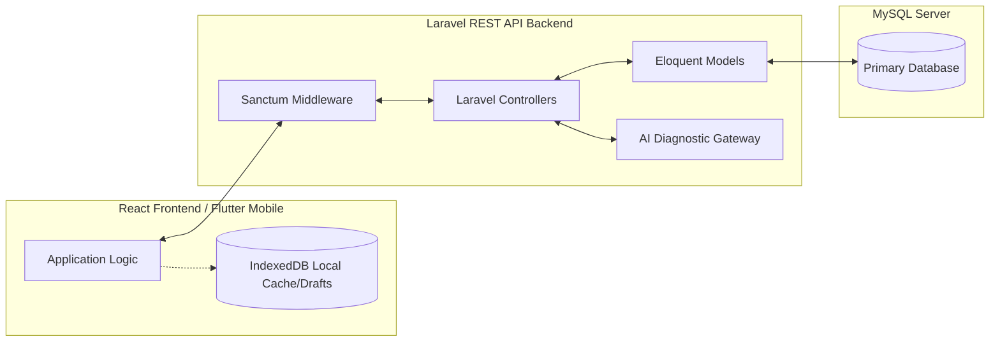
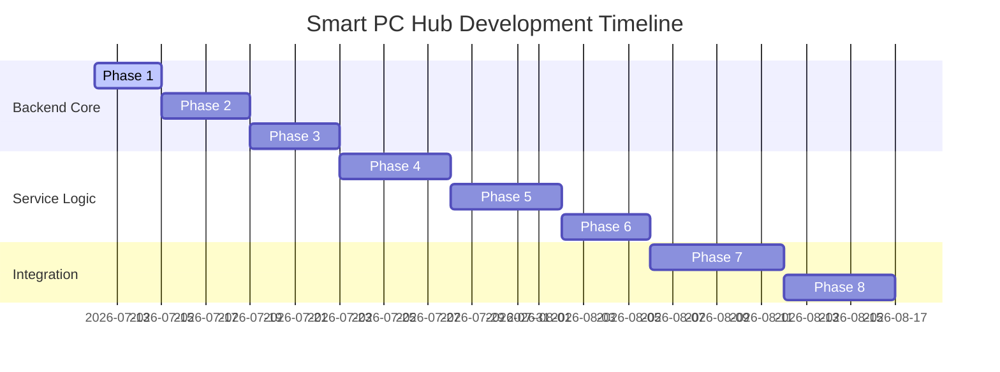

# implementation_plan.md: Smart PC Hub Audit & Laravel Migration Plan (Revised)

This document provides the revised technical audit and implementation plan for the final year project: **Smart PC Hub — PC Build, Maintenance & Repair Management System**. All legacy branding, "System Sentinel" terminology, and complex real-time telemetry streaming components have been removed and replaced with a clean, database-backed service architecture.

---

## 1. Executive Project Summary

**Smart PC Hub** is a multi-actor desktop and mobile-friendly system designed to automate custom PC configuration, component compatibility checks, repair tracking, and service logging. The system caters to three core actors:
*   **Users (Customers)**: Register and manage their profiles, configure custom PC builds (validated by a component compatibility engine), submit repair/maintenance requests, upload issue images, attach static hardware specification profiles, and track request status.
*   **Administrators (Admins)**: Manage user and technician profiles, review all repair requests, assign technicians to specific requests, monitor service status, and generate business reports.
*   **Technicians**: Log in to view assigned jobs, update job status, add parts used and labor details, upload completion proofs, and submit final service reports.

### Migration Objective
Rebuild the system's backend using **Latest Laravel (PHP)** and **MySQL** as the single source of truth, replacing the deprecated stateless Python FastAPI backend and browser-level IndexedDB primary storage.

---

## 2. Current Architecture Review & De-Branding Audit

The current application contains legacy code, branding, and telemetry mechanisms that must be refactored or retired:

1.  **De-Branding Target**: Remove all "System Sentinel", "SystemSentinelDB", "SentinelDB", and related terminology. The client database will be referred to strictly as `SmartPCHubCache`.
2.  **Telemetry simplification**: High-frequency streaming WebSockets (`psutil` probes) and complex aggregators are retired. In their place, the system will support a **Static System Specification Profile** which users can generate client-side (CPU, GPU, RAM, OS, Disk Capacity) and attach to repair requests as static context.
3.  **Authentication & Single Source of Truth**: User authentication and session management will be migrated from client-side simulated checks in IndexedDB to token-based verification via **Laravel Sanctum**. MySQL is the primary system authority; IndexedDB is relegated to optional cache or draft storage.

---

## 3. Complete Code Audit (Deconstruction Checklist)

To clean up the codebase, the following files will be modified or relocated:

| File / Module | Current Implementation | Migration Action |
| :--- | :--- | :--- |
| `App.tsx` | Entrypoint mounting layouts. | Update imports once directory structure is reorganized. |
| `types.ts` | Shared contract definitions. | Rework types: remove `Gig`, `GigCategory`, legacy websocket telemetry profiles. Add `SystemSpecProfile`, updated `RepairRequest` (no gig fields), and Laravel-compatible user models. |
| `constants.tsx` | Configuration arrays. | Remove legacy `SERVICES` definitions referencing telemetry diagnostic services (e.g. storage analyzer, deep memory compactors). Retain only fields relevant to PC building and repair ticketing. |
| `services/db.ts` | SentinelDB IndexedDB. | Rename database to `SmartPCHubCache` and purge stores related to telemetry logs, schedules, and active sockets. Maintain stores only for local offline drafts of PC builds and repair requests. |
| `services/dbHelpers.ts` | IndexedDB logic. | Purge database access helpers and re-route queries directly to Laravel backend API adapters. |
| `services/diagnosticProvider.ts` | Telemetry switching. | Retain simple browser-native API diagnostic captures (e.g., standard OS version, browser info, local storage capacity) and remove Python connection switches. |
| `services/providers/pythonProvider.ts` | Python connection adapter. | [DELETE] Cleanly remove from client services. |
| `services/pcBuilder.ts` | Compatibility logic. | Keep offline calculations in frontend for instant UI feedback, but replicate rules inside Laravel to ensure secure server-side verification. |
| `backend/main.py` | Python FastAPI. | Move to `/backend-python-deprecated` and disable execution commands. |

---

## 4. Frontend Audit (Workflow Restructuring)

### Removing the Gigs Marketplace
The legacy marketplace components (e.g., `BrowseGigs.tsx`, `GigManagement.tsx`) are completely removed. The system is refactored to align with the **Admin Assignment Workflow**:

```
[User submits Request] ➔ [Admin Reviews Dashboard] ➔ [Admin Assigns Technician] 
                              ➔ [Technician Updates Job Status] ➔ [Service Completed & Invoice Filed]
```

*   **User Panel**: Update `NewRepairRequest.tsx` and `ActiveRequestsUser.tsx` to remove any reference to gigs, pricing bids, or choosing technicians. Users simply submit the repair descriptions, system specifications profile, and issue images.
*   **Admin Panel**: Revise `AdminRequestsMgmt.tsx` to support a technician dropdown assignment field, enabling admins to select an active technician for a submitted ticket.
*   **Technician Panel**: Update `TechnicianDashboard.tsx` to list only jobs assigned to the logged-in technician by the administrator.

---

## 5. Python Backend Audit

*   **Relocation Path**: All contents under the current `/backend` folder are moved to `/backend-python-deprecated`.
*   **Startup Disablement**: The `START_SYSTEM.bat` file is modified to run only the frontend dev server and the Laravel server.
*   **Clean Up**: Check `package.json` and remove any legacy proxy references pointing to port 5000.

---

## 6. Laravel Migration & Re-Architecting Strategy



*   **Database Priority**: Laravel + MySQL is the absolute authority for all state management, user accounts, custom PC configurations, tickets, and completion reports.
*   **IndexedDB Role**: Relegated strictly to local cache (e.g., caching component database information for offline building) or storing unsaved drafts (e.g., draft PC builds or offline repair requests).
*   **API Interoperability**: Form responses and validation messages follow standard JSON API structures, facilitating consumption by both the React Web app and the future Flutter Android app.

---

## 7. Database Design Recommendations

The MySQL database schema is structured around Laravel migrations, Eloquent models, and relationships.

### Eloquent Model Architecture & Relationships

#### 1. `User` Model
*   **Attributes**: `id` (UUID), `name`, `email`, `password`, `role` (enum: 'user', 'technician', 'admin'), `status` ('active', 'suspended'), `profile_image` (string/nullable).
*   **Relationships**:
    *   `hasMany(PCBuild::class)`
    *   `hasMany(RepairRequest::class, 'user_id')` (for customers)
    *   `hasMany(RepairRequest::class, 'technician_id')` (for technicians)
    *   `hasOne(TechnicianProfile::class)` (for technicians)

#### 2. `TechnicianProfile` Model
*   **Attributes**: `id`, `user_id` (FK), `specialty`, `rating` (decimal), `is_available` (boolean).
*   **Relationships**:
    *   `belongsTo(User::class)`

#### 3. `RepairRequest` Model
*   **Attributes**: `id` (UUID), `user_id` (FK), `technician_id` (FK/nullable), `issue_category`, `issue_description` (text), `severity_level` ('low', 'medium', 'high'), `status` ('submitted', 'assigned', 'accepted', 'in_progress', 'waiting_parts', 'testing', 'completed', 'cancelled'), `system_specifications` (json/nullable), `user_images` (json/nullable), `tech_images` (json/nullable).
*   **Relationships**:
    *   `belongsTo(User::class, 'user_id')`
    *   `belongsTo(User::class, 'technician_id')`
    *   `hasOne(CompletionReport::class)`
    *   `hasMany(LifecycleEvent::class)`

#### 4. `LifecycleEvent` Model
*   **Attributes**: `id`, `repair_request_id` (FK), `status` (string), `updated_by` (FK/User), `note` (text/nullable), `created_at`.
*   **Relationships**:
    *   `belongsTo(RepairRequest::class)`
    *   `belongsTo(User::class, 'updated_by')`

#### 5. `CompletionReport` Model
*   **Attributes**: `id` (UUID), `repair_request_id` (FK), `issue_summary` (text), `root_cause` (text), `parts_replaced` (json), `labor_cost` (decimal), `total_cost` (decimal), `work_notes` (text/nullable), `time_spent_minutes` (integer).
*   **Relationships**:
    *   `belongsTo(RepairRequest::class)`

#### 6. `PCBuild` Model
*   **Attributes**: `id` (UUID), `user_id` (FK), `build_name`, `cpu`, `gpu`, `motherboard`, `ram`, `storage`, `power_supply`, `chassis`, `estimated_cost_usd` (decimal), `estimated_cost_pkr` (decimal), `compatibility_status` ('pass', 'warning', 'fail'), `performance_score` (integer), `issues` (json/nullable), `bottlenecks` (json/nullable), `status` ('draft', 'submitted_review', 'under_review', 'reviewed'), `technician_id` (FK/nullable), `technician_notes` (text/nullable).
*   **Relationships**:
    *   `belongsTo(User::class, 'user_id')`
    *   `belongsTo(User::class, 'technician_id')`

---

## 8. API Design Recommendations

All responses return standard JSON envelopes. Input requests are validated via dedicated **Laravel Form Request** files.

### Endpoint Structure

| Route | Method | Form Request Class | Resource Class | Description |
| :--- | :--- | :--- | :--- | :--- |
| `/api/v1/auth/register` | POST | `RegisterRequest` | `UserResource` | Registers new user profile. |
| `/api/v1/auth/login` | POST | `LoginRequest` | `TokenResource` | Returns Bearer Token. |
| `/api/v1/auth/logout` | POST | N/A | N/A | Revokes token. |
| `/api/v1/user/profile` | GET | N/A | `UserResource` | Returns authenticated user details. |
| `/api/v1/pc-builds` | GET | N/A | `PCBuildCollection` | Lists saved PC configurations. |
| `/api/v1/pc-builds` | POST | `StorePCBuildRequest` | `PCBuildResource` | Saves new PC configuration. |
| `/api/v1/pc-builds/{id}` | PUT | `UpdatePCBuildRequest` | `PCBuildResource` | Updates saved PC build config. |
| `/api/v1/pc-builds/{id}` | DELETE | N/A | N/A | Deletes custom PC configuration. |
| `/api/v1/repair-requests` | GET | N/A | `RepairRequestCollection` | Fetches tickets (Filtered by user role). |
| `/api/v1/repair-requests` | POST | `StoreRepairRequest` | `RepairRequestResource` | Submits request & handles uploads. |
| `/api/v1/repair-requests/{id}/assign`| POST | `AssignTechnicianRequest`| `RepairRequestResource` | Admin assigns technician to ticket. |
| `/api/v1/repair-requests/{id}/status`| POST | `UpdateStatusRequest` | `RepairRequestResource` | Tech updates repair request status. |
| `/api/v1/repair-requests/{id}/complete`| POST| `CompleteReportRequest` | `CompletionReportResource`| Tech completes job & files invoice. |
| `/api/v1/ai/triage` | POST | `AITriageRequest` | `AITriageResource` | Analyzes specifications & logs issues. |

---

## 9. Security & Role Management

*   **Token Authentication**: Laravel **Sanctum** is used to issue stateful tokens. Tokens are passed in HTTP headers as `Authorization: Bearer <token>` for API requests.
*   **Role-Based Access Control (RBAC)**: Custom Laravel middleware (`RoleMiddleware.php`) validates routing permission boundaries:
    ```php
    Route::middleware(['auth:sanctum', 'role:admin'])->group(function () {
        Route::post('/repair-requests/{id}/assign', [AdminController::class, 'assignTechnician']);
    });
    ```
*   **Authorization Policies**: Laravel **Policies** (e.g. `PCBuildPolicy`, `RepairRequestPolicy`) ensure users can edit only their own builds, and technicians can update only their assigned jobs.

---

## 10. AI Modularization (Decoupled Layer)

To prevent hardcoding Google Gemini (or any specific vendor LLM) into the core architecture:
1.  Define a PHP Interface: `App\Services\AI\AITriageInterface`.
2.  Implement a client class: `App\Services\AI\GeminiTriageService` implementing the interface.
3.  Bind the interface inside `AppServiceProvider.php` dynamically using environment variables:
    ```php
    $this->app->bind(AITriageInterface::class, function ($app) {
        $driver = config('ai.driver', 'local');
        return match($driver) {
            'gemini' => new GeminiTriageService(config('ai.keys.gemini')),
            default => new LocalRuleBasedTriageService(),
        };
    });
    ```
4.  If AI features are toggled off in `.env` (`AI_ENABLED=false`), the local rule-based service runs simple validation heuristics without making external API requests, protecting the platform from external dependencies downtime.

---

## 11. UI/UX Review (Refining Workflow Views)

*   **Remove Marketplace Screens**: Remove gig listings, technician bids, and categories selectors from the user dashboard.
*   **Implement Admin Assignment Panel**: Build an assignment control board inside the Admin view layout, listing available technicians dynamically sorted by availability and specialty.
*   **Image Management**: Rework front-end image upload elements to post files directly to `/api/v1/repair-requests` using multipart forms, rendering uploaded image paths from Laravel's storage asset link (`/storage/uploads/...`).

---

## 12. Project-Wide Engineering Standards

All deliverables must comply with the following standards:

1.  **PSR-12 coding standards**: Enforce strict PHP code styling rules (indentations, naming, class structures).
2.  **Latest Laravel Stable Best Practices**:
    *   Avoid raw SQL queries; use **Eloquent ORM** and Query Builder.
    *   Encapsulate business operations inside **Service Classes**; keep Controllers thin.
    *   Verify request schemas using **Form Requests**.
    *   Transform outputs using **API Resources**.
3.  **SOLID Principles**: Establish single responsibilities for classes (e.g., separating file uploads from status updates).
4.  **DRY & KISS**: Maintain clean reusable utilities, keeping architectures simple and direct.
5.  **Naming Conventions**:
    *   Laravel/PHP: camelCase for variables/methods, PascalCase for classes, snake_case for DB columns.
    *   TypeScript: camelCase for fields, PascalCase for components/interfaces.
6.  **Secure Coding practices**:
    *   Filter and sanitize all user input values.
    *   Never save raw passwords; use PHP `bcrypt` hashing algorithms.
    *   Prevent ID enumeration by using UUIDs for public-facing resource keys.

---

## 13. Missing, Incorrect, and Unnecessary Features

*   **Incorrect (IndexedDB Primary)**: The client application previously assumed data was written to IndexedDB as the primary source. This is corrected; data goes to MySQL via Axios calls, using IndexedDB strictly for drafts.
*   **Unnecessary (WebSocket Server)**: Streaming WebSockets from local OS scripts are retired, significantly simplifying system infrastructure.
*   **Missing (Error Responses)**: Unified error response formatting was missing. Laravel will catch validation exceptions and return uniform JSON errors:
    ```json
    {
      "message": "The given data was invalid.",
      "errors": { "email": ["The email has already been taken."] }
    }
    ```

---

## 14. Technical Debt & Risk Analysis

*   **Offline Conflict management**: Users making drafts offline might save PC configurations that conflict with newer component databases. Mitigation: Verify drafts against Laravel validation endpoints before syncing.
*   **API Endpoint Parity**: React and future Flutter applications must query identical endpoints. Mitigation: Centralize validation specifications and return resource schemas.

---

## 15. Improvement Recommendations

*   Setup **Docker (Laravel Sail)** to guarantee unified development environments across developers.
*   Introduce **Laravel Sanctum API Tokens** with expiration lifecycles.
*   Store media uploads on public symlinks (`php artisan storage:link`).

---

## 16. Final Enterprise Architecture & Folder Layout

The workspace is restructured into the following directory tree:

```
Project Root
├── /frontend                          # React TypeScript application
│   ├── /components                    # Reusable React components
│   ├── /services                      # Axios API adapters (no IndexedDB writes as primary)
│   ├── package.json
│   └── vite.config.ts
├── /backend-laravel                   # Laravel PHP application
│   ├── /app
│   │   ├── /Http
│   │   │   ├── /Controllers/Api/V1    # Versioned REST Controllers
│   │   │   ├── /Requests              # Form Validation Request Classes
│   │   │   └── /Resources             # API Serialization Resources
│   │   ├── /Models                    # Eloquent Models
│   │   └── /Services                  # Decoupled AI and Compatibility services
│   ├── /database
│   │   ├── /migrations                # DB Migration files
│   │   ├── /factories                 # Model Factories for testing
│   │   └── /seeders                   # Seeders for components and test users
│   └── artisan
├── /backend-python-deprecated         # Archived legacy FastAPI backend (Safe rollbacks)
├── /docs                              # Markdown documentation sheets
├── /database-design                   # Entity relationship layouts and schemas
├── /api-spec                          # OpenAPI/Swagger documentation
├── /postman                           # Postman Collections JSON files
├── /flutter                           # Future Mobile Application directory placeholder
├── /storage                           # Persistent server volumes mount
│   └── /uploads                       # Uploaded repair and completion proofs
└── /tests                             # Automated Laravel Unit & Feature Tests
```

---

## 17. Phased Master Development Roadmap



### Phase 1: Workspace Reorganization & Python Deprecation (COMPLETED 2026-07-11)
*   **Status**: Completed.
*   **Prerequisites**: Access to project root directory.
*   **Description**: Move files, isolate React codes inside `/frontend`, place Python code inside `/backend-python-deprecated`, clear dependencies, and update start script scripts.
*   **Deliverables**:
    *   Clean directory tree structure.
    *   `/backend-python-deprecated/DEPRECATED.md` explanation file.
    *   Updated `START_SYSTEM.bat` ignoring python initialization.
*   **Validation Criteria**: Dev server boots cleanly from `/frontend` with zero compiler path issues.
*   **Rollback Plan**: Restore workspace layout from Git backup.
*   **Dependencies**: None.
*   **Estimated Complexity**: Easy.

### Phase 2: Database Schema & Laravel Initialization (COMPLETED — 2026-07-11)
*   **Prerequisites**: Phase 1 completed, local PHP/MySQL environment.
*   **Description**: Initialize Laravel inside `/backend-laravel`, run database migrations, build factories and seeders for hardware component listings and system user templates.
*   **Deliverables**:
    *   Laravel workspace setup.
    *   MySQL Migrations mapping users, requests, PC builds, and reports.
    *   Database Seeders populated with component specs and default profiles.
*   **Validation Criteria**: Run `php artisan migrate:fresh --seed` successfully.
*   **Rollback Plan**: Delete `/backend-laravel` directories and drop MySQL tables.
*   **Dependencies**: Phase 1.
*   **Estimated Complexity**: Medium.

### Phase 3: Auth & Profile API Development (COMPLETED — 2026-07-11)
*   **Prerequisites**: Phase 2 completed.
*   **Description**: Build Auth endpoints, configure Laravel Sanctum, install Role middleware filters, and establish profile updates pipelines.
*   **Deliverables**:
    *   `RegisterRequest`, `LoginRequest`, `UpdateProfileRequest` Form Request validation classes.
    *   `UserResource`, `TokenResource` API Resource classes.
    *   `AuthService` — register, login, logout, updateProfile business logic.
    *   `AuthController` — POST register, POST login, POST logout, GET me.
    *   `UserController` — GET profile, PUT profile.
    *   `AdminController` — listUsers, updateUserStatus, listTechnicians, dashboard.
    *   `RoleMiddleware.php` — RBAC middleware (multi-role, suspended check).
    *   Sanctum API Bearer Token output mechanisms.
    *   AI Triage service layer (interface + 2 implementations + DI binding).
*   **Validation Criteria**: Register a test technician user via HTTP requests, log in to verify token response, and confirm database record creation.
*   **Rollback Plan**: Revert database authentication migration entries.
*   **Dependencies**: Phase 2.
*   **Estimated Complexity**: Medium.

### Phase 4: PC Build Planner & Cost Estimator API (COMPLETED — 2026-07-12)
*   **Prerequisites**: Phase 3 completed.
*   **Description**: Server-side compatibility validation engine, cost estimation, full CRUD, authorization policies, and build status workflow.
*   **Deliverables**:
    *   `CompatibilityService` — CPU+motherboard socket matching, RAM type validation, PSU wattage checks, bottleneck detection, performance scoring (0-100).
    *   `CostEstimationService` — Component-level price estimation in USD and PKR with per-component breakdown.
    *   `StorePCBuildRequest` — Validates required component fields.
    *   `UpdatePCBuildRequest` — Partial updates, recalculates on component change.
    *   `PCBuildResource` — CamelCase API output transformer.
    *   `PCBuildCollection` — Paginated results with metadata.
    *   `PCBuildPolicy` — RBAC authorization (user owns, technician assigned, admin full access).
    *   `PCBuildController` — Full CRUD: index (paginated, role-filtered), store (auto-compatibility + cost), show (policy-gated), update (recalculates), destroy (draft-only), submitForReview (pass-only).
    *   PCBuild model query scopes: `scopeDraft`, `scopeSubmitted`, `scopeForUser`, `scopeAssignedTo`, `scopeCompatible`.
*   **Validation Criteria**: Send invalid CPU + RAM specs payload, receive compatibility warning code and warnings messages. Verify cost estimation matches expected prices.
*   **Rollback Plan**: Remove Phase 4 files (services, requests, resources, policy, controller update).
*   **Dependencies**: Phase 3.
*   **Estimated Complexity**: Medium-High.

### Phase 5: Repair Request Management & Admin Assignment API (COMPLETED — 2026-07-12)
*   **Prerequisites**: Phase 4 completed.
*   **Description**: Full repair management workflow with status state machine, technician assignment, image uploads, completion reports, and lifecycle tracking.
*   **Deliverables**:
    *   `RepairService` — Business logic: create, assign, status update, completion report, image uploads, service history, SLA calculations, admin reports.
    *   `LifecycleService` — Strict state machine for status transitions, immutable lifecycle event creation, transition validation.
    *   `StoreRepairRequestRequest` — Validates issue description, severity, system specs, optional user images.
    *   `AssignTechnicianRequest` — Validates technician_id.
    *   `UpdateRepairStatusRequest` — Validates status transition.
    *   `CompleteReportRequest` — Validates issue summary, root cause, parts list, labor cost, time spent, completion images.
    *   `RepairRequestResource` — CamelCase transformer with nested user, technician, lifecycle events, completion report.
    *   `LifecycleEventResource` — Immutable event transformer with actor.
    *   `CompletionReportResource` — Invoice-ready transformer with parts, costs, timestamps.
    *   `RepairRequestPolicy` — RBAC: customer owns, technician assigned, admin full. Separate methods for assign/status/complete.
    *   `RepairRequestController` — Full CRUD: index (paginated, filtered, searchable), store (with images), show (with SLA), assign (admin), updateStatus (tech/admin), complete (tech), delete, serviceHistory, technicianHistory, adminReport, timeline.
    *   Status transitions: submitted → assigned → accepted → in_progress → waiting_parts/testing → completed/cancelled.
*   **Validation Criteria**: Submit repair request with images, assign to technician, update status through valid transitions, submit completion report with parts and labor cost, verify lifecycle events are created.
*   **Rollback Plan**: Remove Phase 5 files (services, requests, resources, policy, controller).
*   **Dependencies**: Phase 4.
*   **Estimated Complexity**: High.

### Phase 6: Service History, Reports & SLA Tracking (COMPLETED — 2026-07-12)
*   **Prerequisites**: Phase 5 completed.
*   **Description**: Complete service history management, admin reporting, SLA duration calculations, and invoice-ready response structures.
*   **Deliverables**:
    *   Service History API: `GET /user/service-history` (customer), `GET /technician/service-history` (technician).
    *   Admin Reporting: `GET /admin/reports/summary` — total requests, completed/cancelled/active counts, avg completion time, total revenue, category/severity/status breakdowns.
    *   SLA Calculations: `GET /repair-requests/{id}/timeline` — time to assign, time to start, repair duration, total duration, full event timeline.
    *   Invoice-ready response structures (CompletionReportResource with parts list, labor cost, total cost).
    *   Lifecycle timeline with actor names and timestamps.
*   **Validation Criteria**: Query service history for user and technician, verify SLA durations match lifecycle event timestamps, verify admin report aggregates are correct.
*   **Rollback Plan**: Remove Phase 6 routes and controller methods.
*   **Dependencies**: Phase 5.
*   **Estimated Complexity**: Medium.

### Phase 7: Modular AI Triage Engine Integration
*   **Prerequisites**: Phase 5 completed.
*   **Description**: Set up the decoupled AI Triage interfaces, register rule-based local fallbacks, and build key integrations adapters for the Gemini service wrapper.
*   **Deliverables**:
    *   `AITriageInterface.php` interface.
    *   `GeminiTriageService.php` call wrapper.
    *   `LocalRuleBasedTriageService.php` offline validator.
*   **Validation Criteria**: Set `AI_ENABLED=true` in `.env` and verify API triage responses; toggle to `false` and confirm system runs rule-based local calculations.
*   **Rollback Plan**: Disable AI driver keys in configurations.
*   **Dependencies**: Phase 5.
*   **Estimated Complexity**: Medium.

### Phase 8: Frontend API Integration & MySQL Transition
*   **Prerequisites**: All backend phases (Phases 2-7) completed.
*   **Description**: Rework frontend services, replace IndexedDB direct updates, configure Axios client routing, and adapt views to the Admin Assignment workflow.
*   **Deliverables**:
    *   Axios adapter replacing `services/dbHelpers.ts`.
    *   Updated `NewRepairRequest.tsx`, `AdminRequestsMgmt.tsx` views.
    *   Removed gigs and marketplace modules from frontend files.
*   **Validation Criteria**: Run React client, log in using Sanctum, submit build, request repair, and verify database synchronizations in real-time.
*   **Rollback Plan**: Revert frontend changes from Git.
*   **Dependencies**: All previous phases.
*   **Estimated Complexity**: High.

### Phase 9: Verification, UI/UX Polish & Deployment Readiness
*   **Prerequisites**: Phase 8 completed.
*   **Description**: Execute end-to-end user testing pipelines, build postman API tests folders, compile OpenAPI specifications sheets, and configure Docker configurations.
*   **Deliverables**:
    *   Postman API collection templates.
    *   OpenAPI YAML definition sheet.
    *   Fully functional, de-branded deployment suite.
*   **Validation Criteria**: All Postman routes return HTTP 200/201; React UI mounts cleanly without warnings.
*   **Rollback Plan**: None (final verification).
*   **Dependencies**: Phase 8.
*   **Estimated Complexity**: Medium.

---

## Verification Plan

### Automated Tests
*   **Laravel Unit Tests**: Verify services isolations via `php artisan test --testsuite=Unit`.
*   **Laravel Feature Tests**: Validate endpoint authentication and role policies via `php artisan test --testsuite=Feature`.

### Manual Verification
*   **Sanctum Token Checks**: Inspect application local store tokens inside chrome developer options on registration.
*   **Workflow Tests**: Register Customer, submit Repair Request, assign Technician via Admin dashboard, accept/update repair via Technician dashboard, submit invoice, verify completed invoice render.


task.md: Smart PC Hub Tasks List
Phase 1: Workspace Reorganization & Python Deprecation
 Create folder structure for the entire enterprise layout (frontend, backend-laravel, backend-python-deprecated, docs, database, api-spec, postman, flutter, storage, uploads, tests)
 Move existing Python backend into backend-python-deprecated/ and add deprecation indicators
 Move existing frontend code files and directories into frontend/
 Update frontend config references (tsconfig.json, vite.config.ts, package.json scripts) if necessary to ensure it compiles inside the subfolder
 Update START_SYSTEM.bat launcher to run only frontend and prepare for laravel
 Verify frontend compiles and launches successfully in the new directory structure
 Initialize CHANGELOG.md in the root workspace directory
 Update implementation_plan.md with Phase 1 completion notes and deviations
Phase 2: Database Schema & Laravel Initialization
 Rename Phase 8 label in implementation_plan.md to "MySQL Transition"
 Analyze frontend types.ts and finalize MySQL schema (no redundant tables or gig fields)
 Create Laravel project skeleton inside backend-laravel/ using Composer
 Configure .env with MySQL credentials and app settings
 Install Laravel Sanctum and configure API guards
 Write migration: create_users_table (UUID, role enum, status)
 Write migration: create_technician_profiles_table (user_id FK, specialty, rating, availability)
 Write migration: create_repair_requests_table (UUIDs, FKs, status enum, JSON columns)
 Write migration: create_lifecycle_events_table (repair_request_id FK, status, updated_by FK)
 Write migration: create_completion_reports_table (repair_request_id FK, JSON parts, costs)
 Write migration: create_pc_builds_table (UUID, user_id FK, JSON issues/bottlenecks, status)
 Write Eloquent model: User (relationships, role casting)
 Write Eloquent model: TechnicianProfile (belongsTo User)
 Write Eloquent model: RepairRequest (all relationships, status casting)
 Write Eloquent model: LifecycleEvent (belongsTo RepairRequest + User)
 Write Eloquent model: CompletionReport (belongsTo RepairRequest)
 Write Eloquent model: PCBuild (belongsTo User, technician)
 Write Factory: UserFactory (faker data for all 3 roles)
 Write Factory: TechnicianProfileFactory
 Write Factory: RepairRequestFactory
 Write Factory: PCBuildFactory
 Write Seeder: DatabaseSeeder (calls all sub-seeders)
 Write Seeder: UserSeeder (admin, 3 technicians, 5 customers)
 Write Seeder: TechnicianProfileSeeder
 Write Seeder: RepairRequestSeeder (demo requests with lifecycle events)
 Validate: run php artisan migrate:fresh --seed successfully
 Update CHANGELOG.md with Phase 2 entries
  Update implementation_plan.md with Phase 2 completion notes
 Phase 3: Authentication & Profile API Development
  Implement Laravel framework skeleton (artisan, public/index.php, bootstrap/app.php)
  Configure auth.php, sanctum.php, database.php, cors.php
  Write FormRequest: RegisterRequest (name, email unique, password confirmed+mixedCase)
  Write FormRequest: LoginRequest (email, password)
  Write FormRequest: UpdateProfileRequest (optional name, email unique-ignore, optional password)
  Write API Resource: UserResource (camelCase keys, never expose password/tokens)
  Write API Resource: TokenResource (accessToken, tokenType, user nested)
  Write Service: AuthService (register, login, logout, updateProfile with bcrypt)
  Write Controller: BaseController (sendResponse, sendError, sendMessage envelope)
  Write Controller: AuthController (register, login, logout, me)
  Write Controller: UserController (profile, updateProfile)
  Write Controller: AdminController (listUsers, updateUserStatus, listTechnicians, dashboard)
  Write stubs: PCBuildController, RepairRequestController, AIController (501 responses)
  Register RoleMiddleware alias in bootstrap/app.php
  Write AI services: AITriageInterface, LocalRuleBasedTriageService, GeminiTriageService
  Bind AI interface in AppServiceProvider via config driver
  Define all Phase 3 routes in routes/api.php
  Update .env.example with Sanctum stateful domains
  Update CHANGELOG.md with Phase 3 entries
  Stop and await user approval before Phase 4
 Phase 4: PC Build Planner & Cost Estimator API
  Write Service: CompatibilityService (CPU+mobo socket, RAM type, PSU wattage, bottleneck detection, perf scoring)
  Write Service: CostEstimationService (component prices USD/PKR, breakdown)
  Write FormRequest: StorePCBuildRequest (required component fields)
  Write FormRequest: UpdatePCBuildRequest (all optional for partial updates)
  Write API Resource: PCBuildResource (camelCase transformer)
  Write API Resource: PCBuildCollection (paginated metadata)
  Write Policy: PCBuildPolicy (user owns, tech assigned, admin full access)
  Implement PCBuildController: index, store, show, update, destroy, submitForReview
  Add query scopes to PCBuild model (draft, submitted, forUser, assignedTo, compatible)
   Update CHANGELOG.md with Phase 4 entries
   Update implementation_plan.md with Phase 4 completion
   Fix Phase 4 bugs: orWhere grouping, N+1 eager loading, CompatibilityService data-driven refactor
   Stop and await user approval before Phase 5
 Phase 5: Repair Request Management & Admin Assignment API
   Write Service: LifecycleService (status state machine, transition validation, lifecycle event creation)
   Write Service: RepairService (create, assign, updateStatus, completionReport, image uploads, history, SLA, admin report)
   Write FormRequest: StoreRepairRequestRequest (issue description, severity, system specs, user images)
   Write FormRequest: AssignTechnicianRequest (technician_id exists)
   Write FormRequest: UpdateRepairStatusRequest (status in valid transitions)
   Write FormRequest: CompleteReportRequest (issue summary, root cause, parts list, labor cost, time spent)
   Write API Resource: RepairRequestResource (camelCase, nested user/technician/events/report)
   Write API Resource: LifecycleEventResource (immutable event, actor)
   Write API Resource: CompletionReportResource (parts, costs, invoice-ready)
   Write Policy: RepairRequestPolicy (customer owns, tech assigned, admin full access)
   Implement RepairRequestController: index (filtered/searchable), store (with images), show (with SLA), assign, updateStatus, complete, delete
   Add routes: DELETE /repair-requests/{id}, /timeline, service-history, admin/reports
   Update CHANGELOG.md with Phase 5 entries
   Stop and await user approval before Phase 6
 Phase 6: Service History, Reports & SLA Tracking
   Implement GET /user/service-history (customer's completed repairs)
   Implement GET /technician/service-history (technician's assigned repairs)
   Implement GET /admin/reports/summary (aggregate stats, cost/category/severity breakdowns)
   Implement GET /repair-requests/{id}/timeline (SLA durations, full event timeline)
   Update CHANGELOG.md with Phase 6 entries
   Update implementation_plan.md with Phase 5 & 6 completion notes
    Stop and await user approval before Phase 7
 Phase 7: Modular AI Triage Engine Integration
  Create AIManager.php facade for centralized AI operations
  Create AITriageRequest.php form request validation
  Create AITriageResource.php response transformer
  Replace AIController.php stub with full implementation using AIManager
  Verify AITriageInterface, LocalRuleBasedTriageService, GeminiTriageService bindings
  Verify config/ai.php and AppServiceProvider AI binding
  Update CHANGELOG.md with Phase 7 entries
 Phase 8: Frontend API Integration & MySQL Transition
  Create frontend/services/api.ts (Axios client with Sanctum)
  Create frontend/services/authApi.ts (register, login, logout, me, profile)
  Create frontend/services/pcBuildApi.ts (full CRUD + submitForReview)
  Create frontend/services/repairApi.ts (full CRUD + assign, status, complete, timeline)
  Create frontend/services/adminApi.ts (users, technicians, dashboard, reports, AI triage)
  Rewrite frontend/types.ts to align with Laravel API responses
  Update AuthProvider.tsx to use authApi instead of IndexedDB
  Update LoginScreen.tsx and RegisterScreen.tsx (remove Python/Sentinel branding)
  Update ProfileScreen.tsx to use authApi
  Rewrite NewRepairRequest.tsx to use repairApi (remove Gig marketplace)
  Rewrite RequestTechnicianHelp.tsx to use repairApi (remove Gig marketplace)
  Rewrite AdminDashboard.tsx to use adminApi (remove Python telemetry panel)
  Update ActiveRequestsUser.tsx (fix status enum references)
  Update BuildPlanner.tsx (replace System Sentinel branding)
  Update AssignedTechnician.tsx (remove Gig references)
  Update RoleRouter.tsx (remove Python fallback banner)
  Update UserAppLayout.tsx (remove BrowseGigs, replace System Sentinel)
  Update TechnicianAppLayout.tsx (remove GigManagement, replace System Sentinel)
  Update AdminAppLayout.tsx (replace System Sentinel)
  Simplify diagnosticProvider.ts (BROWSER/MOCK modes, remove Python)
  Replace useSystemData.ts (remove telemetryStreamManager, use polling)
  Update HealthIntelligence.tsx (replace geminiService with inline scoring)
  Update constants.tsx (remove BROWSE_GIGS, GIG_MANAGEMENT)
  Update telemetryContract.ts (remove Python/Pydantic comments)
  Update vite.config.ts (PWA manifest: Smart PC Hub)
  Remove legacy files: pythonProvider, telemetryBridge, telemetryQueue, telemetryStreamManager, etc.
  Remove Gig Marketplace: BrowseGigs.tsx, GigManagement.tsx
  Downgrade db.ts to cache/draft-only storage
  Recreate mockProvider.ts as minimal fallback
  Update CHANGELOG.md with Phase 8 entries